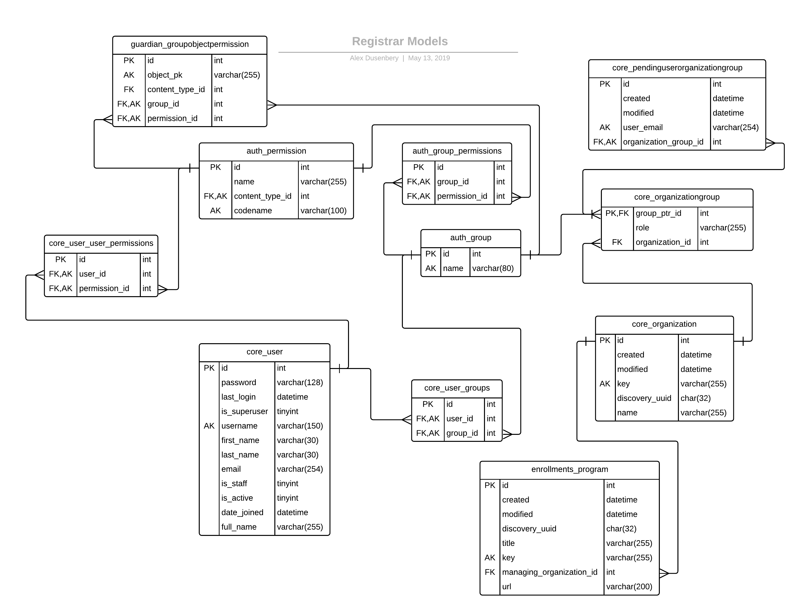
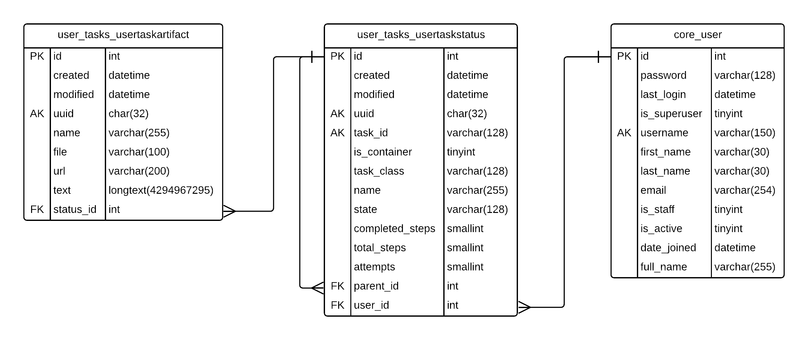

Overview of the Registrar System
================================

Registrar is a service that facilitates integration of learner-program data
between third parties (primarily learning organizations, or "schools") and edX systems.  It is
primarily composed of a ReSTful HTTP API that allows for the reading, writing, modification, and deletion
of data representing the relationship between a set of learners known to a given organization
and degree programs offered by the school, as well as the courses that compose that program.

There are two main focuses of the registrar service:

#. Access control: It allows read and/or write access to learner/program/course data
   only to clients associated with the organization who are granted an appropriate level of access.

#. The management of asynchronous jobs that allow for batch reads of learner/program/course data.

Broad Entity-Relationship Diagram
---------------------------------

Access Control
--------------

There are two primary models we use for capturing information about degree programs and the organization
that manages a program:

#. The ``core.Organization`` model - this represents an organization that manages some degree program:

   - ``id`` - The primary key of the table that underpins this model.
   - ``discovery_uuid`` - The UUID of the organization defined by the catalog service at
     https://discovery.edx.org/api/v1/organizations/  We treat this UUID as the primary key
     of an organization for reference between systems.
   - ``key`` - This field is the primary self-identifier used by organizations when making requests
     for resources via registrar.  This model manages the relationship between this external
     (from an edX system's perspective) key and the shared ``discovery_uuid`` identifier of the
     organization.

#. The ``enrollments.Program`` model - this model represents a degree program.  Notable fields include:

   - ``id`` - The primary key of the table that underpins this model.
   - ``discovery_uuid`` - The UUID of the program entity defined by the catalog service at
     e.g. https://discovery.edx.org/api/v1/programs/{some-uuid}/  We treat this UUID as the primary
     key of a program for reference between systems.  For instance, the LMS, registrar, and the catalog
     service can all "talk about" the same program based on the program's UUID.
   - ``key`` - The primary key of the program from the managing organization's perspective.  Organizations
     can make requests for program resources based on the ``key`` field - this model is in charge of
     managing the relationship between this external (from an edX system's perspective) key and the shared
     ``discovery_uuid`` identifier.
   - ``managing_organization_id`` - A foreign key to the ``core.Organization.id`` field.  We consider
     the "managing organization" of a program to be the organization entity that is primary responsible
     for reading/writing/updating data about the program and enrollments thereof.

Object-level Permissions via Guardian
~~~~~~~~~~~~~~~~~~~~~~~~~~~~~~~~~~~~~

We need some way of associating a client of the registrar API with an ``Organization``,
so that we can control which data a particular API client has access to (i.e. we want object-level access-control).

(Note: See below for how the ``JwtAuthentication`` class enables us to have ``core.User`` records created automatically,
with a user's email and username, upon their first authentication to the registrar service.)

There are many Django packages that aim to facilitate permissions and access-control:
https://djangopackages.org/grids/g/perms/ For this service, we chose django-guardian:
https://django-guardian.readthedocs.io/en/stable/index.html . Guardian provides object-level permissions
for both users and groups in Django, and also allows for the usual Django usage of
``user.has_perm('permission_name', some_object)``.  Guardian:

   - Supports object-permission assignment to both Users and Groups.
   - Integrates with the core Django permissions API (e.g. you can call ``user.has_perm('some_permission', some_object)``)
   - Can assign/persist permissions dynamically.
   - Nice support for managing object-level permissions from inside Django Admin:
     https://django-guardian.readthedocs.io/en/stable/userguide/admin-integration.html#admin-integration
   - It's widely-used (according to Django docs).
   - It doesn't have the concept of roles (named permission sets), although we've created our own
     simple Role concept within registrar.

Associating client permissions with an Organization
^^^^^^^^^^^^^^^^^^^^^^^^^^^^^^^^^^^^^^^^^^^^^^^^^^^

We use Django Groups to assign a set of permissions for particular objects to a specific set of users,
thanks to django-guardian.  We also know that we'll have a ``core.User`` record corresponding to each
API client of Registrar (once authenticated).

What we want now is to be able to customize the Group model just a bit to include two more pieces of information:
the specific ``Organization`` object that the group is associated with, and some kind of role field,
so that we can distinguish between different types of users associated with the same organization,
e.g. the Faber College Administrators group vs. the Faber College Read-Only group.  For this reason,
we've introduced the ``core.OrganizationGroup``  model.  This model inherits from ``auth.Group``
and contains two custom fields: ``organization_id`` - a foreign key that points at the associated ``Organization``
entity, and ``role`` - which can be valued by the name of any role (permission set) from amongst a constant
set of roles (i.e. the roles are defined in code, only).

We use Guardian to help assign permissions from a given role to the ``Organization`` object that is related
to a given ``OrganizationGroup``.  From the API's perspective, a requesting client has any permission on a
requested program that an ``OrganizationGroup`` has on the managing organization of that program.

How Authentication Works
------------------------

Authentication from the Registrar service against LMS or Discovery
~~~~~~~~~~~~~~~~~~~~~~~~~~~~~~~~~~~~~~~~~~~~~~~~~~~~~~~~~~~~~~~~~~

The following steps will help your local Registrar container communicate with your local
Discovery and LMS services.

#. Create a ``registrar_worker`` user on LMS.

#. Setup a Django Oauth Toolkit (DOT) application for ``registrar_worker`` in your local LMS.
   See examples at http://localhost:18000/admin/oauth2_provider/application/

#. When making API calls into LMS or Discovery service within Registrar,
   leverage the edx-rest-api-client library https://github.com/openedx/edx-rest-api-client/blob/master/edx_rest_api_client/client.py#L88
   by providing ``settings.BACKEND_SERVICE_EDX_OAUTH2_KEY`` and ``settings.BACKEND_SERVICE_EDX_OAUTH2_SECRET``.

Authentication from External system against Registrar API
~~~~~~~~~~~~~~~~~~~~~~~~~~~~~~~~~~~~~~~~~~~~~~~~~~~~~~~~~

Authentication for the edX Registrar Service REST API is handled via JWT Tokens issued by the edX LMS.
In order to request a JWT token, a client must first have an edX LMS account that has been granted API access.
Here is the step by step instruction to obtain the JWT Tokens:

#. Register an edX LMS account you are planning to use for integration with the API.
   For example, ``registrar_worker@my_org.edu`` should have a user account in the LMS.

#. In a local/devstack environment, setup a Django Oauth Toolkit (DOT) application corresponding to the user
   created in step (1) on LMS. This is done at http://localhost:18000/admin/oauth2_provider/application/

   For real clients using production systems, the client must contact ``partner-support@edx.org``
   with the email address from the user created.  edX needs to set up the API user permission in the system.
   This is a one-time setup, after which a confirmation email from edX is sent to the client.

#. Next, you need to obtain the ``client_key`` and ``client_secret`` assocatied with the DOT application
   created in step (2).  This can be obtained directly from the DOT application page in the LMS Django Admin
   on local/devstack environments.

   Production clients must do the following:

   #. Log in to the edX LMS with the account registered above. 
   #. Navigate to https://courses.edx.org/api-admin/. Submitting the form will
      create a request which will be reviewed and approved by an edX administrator.
   #. Once the request has been approved, they can navigate to https://courses.edx.org/api-admin/status
      which will display the ``client_id`` and ``client_secret``.

#. Once you have your ``client_id`` and ``client_secret``, you can make a POST request
   to https://courses.edx.org/oauth2/access_token/ or
   http://localhost:18000/oauth2/access_token (for local development) which will return
   a JSON dictionary containing the JWT.

   #. Example::

        curl -X POST -d \
          "client_id={your_client_id}&\
          client_secret={your_client_secret}&\
          grant_type=client_credentials&\
          token_type=jwt" http://localhost:18000/oauth2/access_token/

#. You can then use the JWT in the response to make requests of the registrar REST API::

     curl -v -L -X POST -d '[{"student_key":"1234", "status":"active"}]' \
       -H "Authorization: JWT {YOUR_JWT_HERE}" \
       -H "Content-Type: application/json" \
       http://localhost:18734/api/v1/programs/{program_id}/courses/{course_id}/enrollments/

The JwtAuthentication Class
~~~~~~~~~~~~~~~~~~~~~~~~~~~

The ``edx-drf-extensions`` library provides an authentication class called ``JwtAuthentication``.
Any viewset we have that needs any level of authentication or access control should include ``JwtAuthentication``
in its list of ``authentication_classes`` (which is a class-level field on the viewset).
When using a JWT to authenticate a user, the ``JwtAuthentication`` class checks the
Django application's user table (which is ``core.User`` in our case), and gets or creates the user object
with the username and email provided in the JWT.

How ``edx-drf-extensions`` helps us create a new user in registrar from a JWT:
https://github.com/openedx/edx-drf-extensions/blob/master/edx_rest_framework_extensions/auth/jwt/authentication.py#L54-L55

Asynchronous Jobs
-----------------

Any GET API calls to retrieve learner-program enrollment data or learner-course enrollment data begins
an asynchronous job to fetch the list of students in the specified program or course.  The response to
a GET API request returns a URL that can be used to retrieve the current status of a job.  When the job is complete,
that URL will contain the results of the job as a JSON object.

We use the ``django-user-tasks`` library to manage the creation and execution of these user-triggered tasks.  See:
https://django-user-tasks.readthedocs.io/en/latest/

User Task Models
~~~~~~~~~~~~~~~~

There are functions to manage the following aspects of user tasks in the ``registrar.core.jobs`` module:

- The creation of jobs.
- Checking the status of jobs.
- Fetching the results of jobs.
- Posting data about the success or failure of a job.
- Job storage - we support either local filesystem storage or AWS S3.
